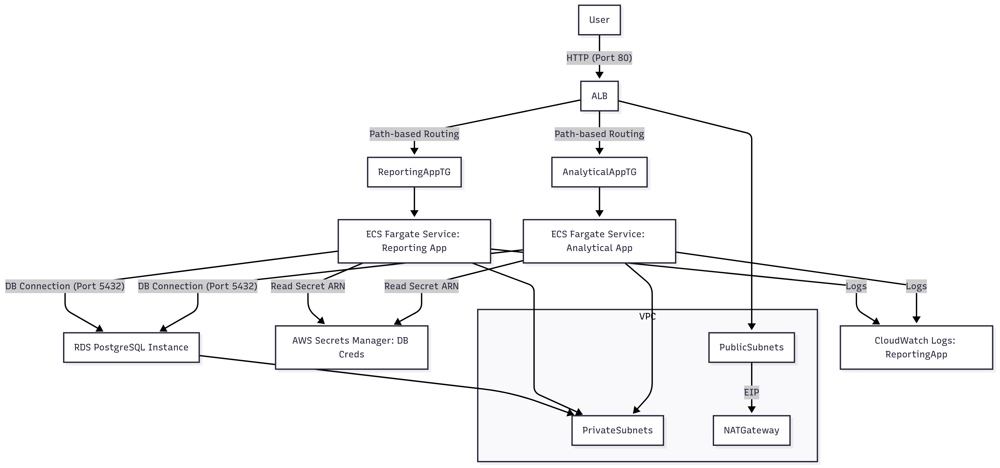

# AWS Fargate Application Infrastructure - Modular Terraform


This repository contains Terraform code to deploy a highly available and scalable application infrastructure on AWS using ECS Fargate, a PostgreSQL RDS database, and an Application Load Balancer (ALB). The infrastructure is modularized for better organization, reusability, and maintainability.

## 🚀 Current Architecture Overview

This setup deploys a foundational AWS infrastructure to host two distinct web applications (an "Analytical App" and a "Reporting App") that share a common PostgreSQL database.

### Key Components Deployed:

* **Networking (VPC):**
    * A custom Virtual Private Cloud (VPC) with public and private subnets across two Availability Zones (AZs) for high availability.
    * An Internet Gateway for outbound internet access from public subnets.
    * A NAT Gateway (1 per AZ, but configured for 1 in dev) in the public subnet to allow outbound internet access for resources in private subnets (e.g., Fargate tasks, RDS).
    * Appropriate Route Tables and associations to direct traffic.
* **ECS Cluster:** A dedicated Amazon Elastic Container Service (ECS) cluster to host Fargate services.
* **Database (RDS PostgreSQL):**
    * An Amazon RDS PostgreSQL instance for persistent data storage.
    * Credentials (username and a randomly generated password) securely stored in AWS Secrets Manager.
    * Configured for Multi-AZ deployment (if `is_production` is `true`) for high availability and automatic backups.
* **Shared Application Load Balancer (ALB):**
    * A single Internet-facing ALB to distribute incoming HTTP traffic to the ECS services.
    * A default listener on Port 80 (HTTP) with a fixed 404 response if no rules match.
    * Path-based routing rules to direct traffic to the correct Fargate service.
* **ECS Fargate Services (Two Applications):**
    * **Analytical App:** An ECS Fargate service designed for analytical workloads.
        * Container port 8000.
        * Routes traffic from ALB path `/api/*` and `/`.
    * **Reporting App:** A new ECS Fargate service for reporting purposes.
        * Container port 8080.
        * Routes traffic from ALB path `/reporting` and `/reporting/*`.
    * Each service runs in private subnets for enhanced security.
    * Dedicated IAM Task Roles with permissions to read database credentials from Secrets Manager.
    * Dedicated ECR repositories for Docker images.
    * CloudWatch Log Groups for container logs.
* **Security Groups:** Finely tuned security groups to control network access between the ALB, ECS services, and the RDS database.
* **IAM Roles:** Necessary IAM roles for ECS task execution and task-specific permissions.

```mermaid
graph TD
    User -- HTTP (Port 80) --> ALB
    ALB -- Path-based Routing --> AnalyticalAppTG
    ALB -- Path-based Routing --> ReportingAppTG
    AnalyticalAppTG --> AnalyticalAppService[ECS Fargate Service: Analytical App]
    ReportingAppTG --> ReportingAppService[ECS Fargate Service: Reporting App]
    AnalyticalAppService -- Read Secret ARN --> AWSSecretsManager[AWS Secrets Manager: DB Creds]
    AnalyticalAppService -- DB Connection (Port 5432) --> RDS[RDS PostgreSQL Instance]
    ReportingAppService -- Read Secret ARN --> AWSSecretsManager
    ReportingAppService -- DB Connection (Port 5432) --> RDS
    AnalyticalAppService -- Logs --> CloudWatchLogs[CloudWatch Logs: AnalyticalApp]
    ReportingAppService -- Logs --> CloudWatchLogs[CloudWatch Logs: ReportingApp]
    SubGraph VPC
        VPC --> PublicSubnets
        VPC --> PrivateSubnets
        PublicSubnets -- EIP --> NATGateway
        ALB --> PublicSubnets
        AnalyticalAppService --> PrivateSubnets
        ReportingAppService --> PrivateSubnets
        RDS --> PrivateSubnets
    end

```


# Architecture Diagram
# The architecture diagram is a visual representation of the infrastructure components and their relationships.
# It is a simplified representation of the actual infrastructure setup.
.
├── main.tf                 # Root module: orchestrates other modules, passes global variables.
├── variables.tf            # Root module: global input variables for the entire stack.
├── outputs.tf              # Root module: global outputs from the deployed infrastructure.
├── modules/
│   ├── vpc/                # Deploys the core networking infrastructure (VPC, subnets, NAT Gateway).
│   │   ├── main.tf
│   │   ├── variables.tf
│   │   └── outputs.tf
│   ├── rds/                # Deploys the RDS PostgreSQL instance and Secrets Manager secret.
│   │   ├── main.tf
│   │   ├── variables.tf
│   │   └── outputs.tf
│   ├── ecs_cluster/        # Deploys the ECS Fargate cluster.
│   │   ├── main.tf
│   │   ├── variables.tf
│   │   └── outputs.tf
│   ├── alb/                # Deploys the Application Load Balancer and its HTTP listener.
│   │   ├── main.tf
│   │   ├── variables.tf
│   │   └── outputs.tf
│   └── ecs_service/        # A reusable module to deploy an individual ECS Fargate service.
│       │                   # (Includes Task Def, ECR, Log Group, IAM Roles, Target Group, ListenerRule)
│       ├── main.tf
│       ├── variables.tf
│       └── outputs.tf


### 📋 Prerequisites

Before you can deploy this infrastructure, ensure the following tools and accounts are set up:

- ***Terraform CLI:*** Installed (`v1.0+` recommended)
- ***AWS CLI:*** Installed and configured with sufficient credentials
- ***Docker:*** Installed and running locally
- ***AWS Account:*** Active account with required permissions

---

### 🚀 Deployment Steps

Follow these steps to deploy the infrastructure:

---

## 1. Clone the Repository

```bash
git clone <your-repo-url>
cd <your-repo-directory>
```

## **2. Initialize Terraform**

Navigate to the root of the project and initialize Terraform.

```bash
terraform init
```
### **3. Build and Push Docker Images to ECR**

Terraform will create the ECR repositories, but you must manually build and push Docker images.

> ***Note:*** Replace `<YOUR_AWS_ACCOUNT_ID>` and `<YOUR_AWS_REGION>` (e.g., `ap-southeast-2`) with your actual values.

---

## a. Analytical App

```bash
# Login to ECR
aws ecr get-login-password --region ap-southeast-2 | docker login --username AWS --password-stdin <YOUR_AWS_ACCOUNT_ID>.dkr.ecr.ap-southeast-2.amazonaws.com

# Build the image
docker build -t mywebapp/analytical-app:latest .

# Tag the image
docker tag mywebapp/analytical-app:latest <YOUR_AWS_ACCOUNT_ID>.dkr.ecr.ap-southeast-2.amazonaws.com/mywebapp/analytical-app:latest

# Push to ECR
docker push <YOUR_AWS_ACCOUNT_ID>.dkr.ecr.ap-southeast-2.amazonaws.com/mywebapp/analytical-app:latest
```

## b. Reporting App

```bash
# Build the image
docker build -t mywebapp/reporting-app:latest -f reporting_app/Dockerfile reporting_app

# Tag the image
docker tag mywebapp/reporting-app:latest <YOUR_AWS_ACCOUNT_ID>.dkr.ecr.ap-southeast-2.amazonaws.com/mywebapp/reporting-app:latest

# Push to ECR
docker push <YOUR_AWS_ACCOUNT_ID>.dkr.ecr.ap-southeast-2.amazonaws.com/mywebapp/reporting-app:latest
```
## 4. Review the Plan
Always check what Terraform will do before applying changes:

```bash
terraform plan
```

### 5. Apply the Configuration

Apply the plan and confirm when prompted:

```bash
terraform apply
```
## 6. Using Environment-Specific Variables (.tfvars Files)

- You can customize deployments by using .tfvars files.
- Example: prod.tfvars
```bash
aws_region    = "ap-southeast-2"
project_name  = "MyProdWebApp"
environment   = "prod"
is_production = true
```
# Apply using the file:
```bash
terraform plan -var-file="prod.tfvars"
terraform apply -var-file="prod.tfvars"
```

### 📊 Outputs
After a successful deployment, Terraform will output the ALB DNS name:

* - Outputs:

alb_dns_name = "mywebapp-dev-alb-123456789.ap-southeast-2.elb.amazonaws.com"

You can access your services using:

Analytical App: http://<ALB_DNS_NAME>/ or http://<ALB_DNS_NAME>/api/somepath

Reporting App: http://<ALB_DNS_NAME>/reporting or http://<ALB_DNS_NAME>/reporting/somepath

## 🧹 Cleanup
To destroy all deployed resources:

```bash
terraform destroy
```

## If you used a .tfvars file during deployment, destroy with it:

```bash
terraform destroy -var-file="prod.tfvars"
```

## ⚠️ Current Limitations (To Be Improved)
- This setup is functional but has areas for improvement:
- Local Terraform State: State is stored locally instead of a remote backend (e.g., S3 + DynamoDB)
- HTTP Only: ALB listener is configured for HTTP only (port 80); HTTPS not enabled
- No ECS Auto-Scaling: Services use a fixed desired_count = 1 without auto-scaling
- Basic Monitoring: CloudWatch Logs are set up, but no alarms or metrics dashboards
- Manual Docker Image Management: Images must be manually built and pushed to ECR
- No CI/CD Pipeline: No automated pipeline for continuous integration and deployment